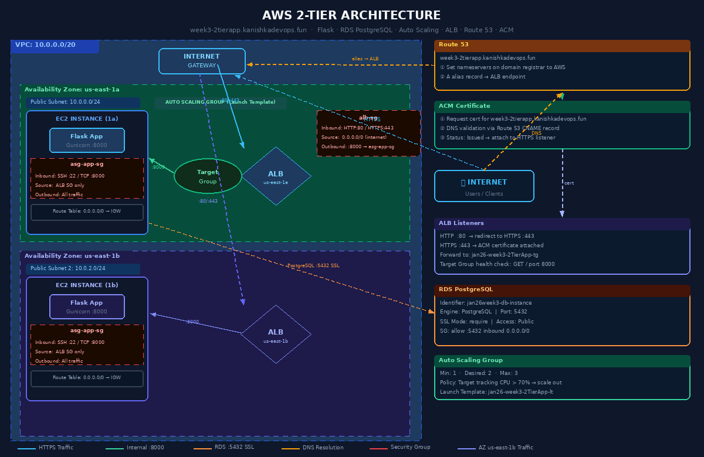

# Student Registration Application

A Flask web application deployed on AWS with a fully automated, production-grade 2-tier architecture using EC2, RDS, Auto Scaling, Application Load Balancer, Route 53, and ACM.

## 🏗️ Architecture Overview




**AWS Services Used:**
- **EC2** - Application servers
- **Auto Scaling Group** - Automatic scaling (min 1, max 3)
- **Application Load Balancer** - Traffic distribution + SSL termination
- **RDS PostgreSQL** - Database (publicly accessible)
- **Route 53** - DNS management
- **ACM** - Free SSL/TLS certificate
- **Launch Template** - EC2 configuration blueprint

**Application Stack:**
- **Backend**: Flask 3.1.0 (Python)
- **Database ORM**: SQLAlchemy
- **Web Server**: Gunicorn
- **OS**: Amazon Linux 2023

---

## 📁 Project Structure

```
week03/day2/
├── app.py                     # Main Flask application
├── init_db.py                 # Database initialization script
├── requirements.txt           # Python dependencies
├── run.sh                     # Application startup (reads env vars)
├── user-data.sh.example       # EC2 user data template ✅ commit this
├── user-data.sh               # Your actual user data ⚠️ keep local
├── .env.example               # Environment variables template
├── .gitignore                 # Prevents committing credentials
└── README.md                  # This file
```

**Safe to commit to GitHub:** `app.py`, `run.sh`, `init_db.py`, `requirements.txt`, `user-data.sh.example`, `.env.example`, `.gitignore`

**Keep local only:** `user-data.sh` (contains your credentials)

---

## 🔐 Credential Management

Credentials are **never stored in GitHub**. They are passed securely via EC2 User Data at launch time.

```
user-data.sh (local only)  →  EC2 User Data  →  Environment Variables  →  app.py
```

`run.sh` reads from environment variables set by `user-data.sh`:
```bash
export DB_HOST="your-rds-endpoint.amazonaws.com"
export DB_NAME="jan26week3db"
export DB_USER="postgres"
export DB_PASSWORD="your-password"
export DB_PORT="5432"
export DB_SSL_MODE="require"
```

---

## 🚀 Deployment Guide

---

### PART 1: Create RDS PostgreSQL Database

1. Go to **AWS RDS Console → Create database**
2. Configure:
   - Engine: `PostgreSQL`
   - Template: `Free tier`
   - DB instance identifier: `jan26week3-db-instance`
   - Master username: `postgres`
   - Master password: *(set a strong password)*
   - **Public access: Yes**
3. **Configure Security Group — Add Inbound Rule:**
   ```
   Type:     PostgreSQL
   Port:     5432
   Source:   0.0.0.0/0
   ```
4. Wait for status: **Available**
5. Note the **endpoint URL** — you will need it for user-data.sh

---

### PART 2: Create Launch Template

> The Launch Template is the blueprint EC2 uses to spin up new instances automatically.

**Step 1:** Go to **EC2 → Launch Templates → Create launch template**

**Step 2:** Configure:
| Setting | Value |
|---------|-------|
| Name | `jan26-week3-2TierApp-lt` |
| AMI | Amazon Linux 2023 (latest) |
| Instance type | `t2.micro` |
| Key pair | `jan26-key` |
| Subnet | `public-jan26` |
| Availability Zone | `ap-south-1a` |

**Step 3:** Create new Security Group `asg-app-sg`:
```
Inbound Rules:
  SSH (22)         from 0.0.0.0/0
  Custom TCP (8000) from 0.0.0.0/0
```

**Step 4:** Under **Advanced details → User data**, paste your `user-data.sh` content:
```bash
#!/bin/bash

# Database credentials (keep this file local - do not commit to GitHub!)
export DB_HOST="jan26week3-db-instance.c4hw00gywz3b.us-east-1.rds.amazonaws.com"
export DB_NAME="jan26week3db"
export DB_USER="postgres"
export DB_PASSWORD="YourSecurePassword"
export DB_PORT="5432"
export DB_SSL_MODE="require"
export SECRET_KEY="$(openssl rand -base64 32)"

# Deploy application
sleep 30
cd /home/ec2-user
echo "$(pwd)" >> /home/ec2-user/install-logs.txt
sudo yum install git -y
git clone --no-checkout https://github.com/kanishkamahanama/LivingDevOpsJan26.git
cd LivingDevOpsJan26
git sparse-checkout init --cone
git sparse-checkout set week03/day2
git checkout main
cd week03/day2
echo "$(pwd)" >> /home/ec2-user/install-logs.txt
chmod u+x run.sh init_db.py
./run.sh >> /home/ec2-user/install-logs.txt 2>&1
```

**Step 5:** Click **Create launch template**

**Step 6:** Test the template:
- Go to **Launch Templates → Actions → Launch instance from template**
- Launch with default settings
- Verify:
  ```bash
  ssh -i jan26-key.pem ec2-user@<PUBLIC_IP>
  cat /home/ec2-user/install-logs.txt
  curl http://localhost:8000
  ```
- Test in browser: `http://<PUBLIC_IP>:8000`
- ✅ Working? **Terminate the test instance** before continuing.

---

### PART 3: Create Auto Scaling Group

> ASG automatically launches and terminates EC2 instances based on load.

**Step 1:** Create a second public subnet (ALB requires at least 2 AZs):

Go to **VPC → Subnets → Create subnet**:
| Setting | Value |
|---------|-------|
| Name | `public-jan26-2` |
| VPC | `jan26-vpc` |
| AZ | `ap-south-1b` *(different from first!)* |
| CIDR | `10.0.3.0/24` |

Associate with public route table:
- **VPC → Route Tables → `public-rt-jan26`**
- **Subnet Associations → Edit → Add `public-jan26-2` → Save**

**Step 2:** Go to **EC2 → Auto Scaling Groups → Create**:
| Setting | Value |
|---------|-------|
| Name | `jan26-week3-2TierApp-asg` |
| Launch template | `jan26-week3-2TierApp-lt` (latest version) |
| VPC | `jan26-vpc` |
| Subnets | `public-jan26` |
| Load balancing | No load balancer *(attach later)* |
| Desired capacity | `2` |
| Minimum | `1` |
| Maximum | `3` |

**Step 3:** Scaling policy:
```
Type:   Target tracking
Metric: Average CPU utilization
Target: 70%
```

**Step 4:** Create ASG and wait 2-3 minutes.

Check **Instance management** tab — you should see 2 instances launching.

---

### PART 4: Create Target Group

> Target Group tells the ALB which instances to send traffic to and how to health check them.

Go to **EC2 → Target Groups → Create**:
| Setting | Value |
|---------|-------|
| Target type | `Instances` |
| Name | `jan26-week3-2TierApp-tg` |
| Protocol | `HTTP` |
| Port | `8000` |
| VPC | `jan26-vpc` |

**Health check settings:**
| Setting | Value |
|---------|-------|
| Protocol | `HTTP` |
| Path | `/` |
| Port | `8000` |

> ⚠️ Do **NOT** manually register targets — they will be registered automatically by the ASG.

Click **Next → Create target group**

---

### PART 5: Create Application Load Balancer

> ALB distributes incoming traffic across multiple EC2 instances.

**Step 1:** Go to **EC2 → Load Balancers → Create → Application Load Balancer**:
| Setting | Value |
|---------|-------|
| Name | `jan26-week3-2TierApp-alb` |
| Scheme | `Internet-facing` |
| VPC | `jan26-vpc` |
| Subnets | `public-jan26` (ap-south-1a) AND `public-jan26-2` (ap-south-1b) |

**Step 2:** Create new Security Group `alb-sg`:
```
Inbound Rules:
  HTTP  (80)  from 0.0.0.0/0
  HTTPS (443) from 0.0.0.0/0
```

**Step 3:** Configure Listener:
| Setting | Value |
|---------|-------|
| Protocol | `HTTP` |
| Port | `80` |
| Default action | Forward to `jan26-week3-2TierApp-tg` |

**Step 4:** Click **Create load balancer**. Wait 2-3 minutes for status: **Active**.

**Step 5:** Attach ASG to Target Group:
- Go to **Auto Scaling Groups → `jan26-week3-2TierApp-asg` → Edit**
- **Load balancing** → Add `jan26-week3-2TierApp-tg`
- Save

---

### PART 6: Configure DNS with Route 53

> Route 53 routes your custom domain to the ALB.

**Step 1:** Go to **Route 53 → Hosted zones → Your domain → Create record**:
| Setting | Value |
|---------|-------|
| Record name | `week3` *(creates week3.yourdomain.com)* |
| Record type | `A` |
| Alias | `Yes` |
| Route traffic to | Application and Classic Load Balancer |
| Region | `us-east-1` |
| Load balancer | `jan26-week3-2TierApp-alb` |

**Step 2:** Click **Create records**

**Step 3:** Wait 2-3 minutes for DNS propagation, then test:
```
http://week3.yourdomain.com
```
✅ Flask app should load — but will show "Not Secure" until HTTPS is added.

---

### PART 7: Add HTTPS with ACM

> ACM provides a free SSL/TLS certificate for HTTPS encryption.

**Step 1: Request SSL Certificate**

Go to **Certificate Manager → Request certificate**:
| Setting | Value |
|---------|-------|
| Domain name | `week3.yourdomain.com` |
| Validation method | `DNS validation` |
| Export | Do NOT enable *(keeps it free)* |

Click **Request**

**Step 2: Validate Certificate**
- Click on the new certificate
- Click **Create records in Route 53** *(auto-creates validation DNS record)*
- Wait for status: **Issued** (~5-10 minutes)

**Step 3: Add HTTPS Listener to ALB**

Go to **Load Balancers → Select ALB → Listeners tab → Add listener**:
| Setting | Value |
|---------|-------|
| Protocol | `HTTPS` |
| Port | `443` |
| Default action | Forward to `jan26-week3-2TierApp-tg` |
| Security policy | Recommended |
| SSL certificate | From ACM → `week3.yourdomain.com` |

Click **Add**

**Step 4: Test HTTPS**
```
https://week3.yourdomain.com
```
🔒 Should load with a valid SSL certificate.

---

## 🗄️ Database Schema

### Students Table

| Column | Type | Constraints |
|--------|------|-------------|
| id | INTEGER | PRIMARY KEY, AUTO INCREMENT |
| name | VARCHAR(100) | NOT NULL |
| email | VARCHAR(120) | UNIQUE, NOT NULL |
| created_at | TIMESTAMP | DEFAULT CURRENT_TIMESTAMP |

---

## 🛠️ Troubleshooting

### App Not Starting on EC2
```bash
ssh -i jan26-key.pem ec2-user@<PUBLIC_IP>

# Check deployment logs
cat /home/ec2-user/install-logs.txt

# Check if Gunicorn is running
ps aux | grep gunicorn

# Check app manually
curl http://localhost:8000/health
```

### Database Connection Timeout
```bash
# Test if RDS is reachable
nc -zv your-rds-endpoint.amazonaws.com 5432
```
- Verify RDS security group allows inbound port 5432 from `0.0.0.0/0`
- Verify RDS "Publicly accessible" is set to **Yes**

### SSL Error: `no pg_hba.conf entry ... no encryption`
- Ensure `DB_SSL_MODE="require"` is set in user-data.sh

### Students Table Missing
```bash
source .venv/bin/activate
python init_db.py
```

### ALB Health Checks Failing
- Verify app is running on port **8000**
- Verify security group `asg-app-sg` allows port 8000
- Check health check path is `/` and returns HTTP 200

### Instances Not Registering with Target Group
- Confirm ASG is linked to the target group
- Wait 3-5 minutes for instances to pass health checks

### HTTPS Certificate Not Issuing
- Ensure DNS validation record was created in Route 53
- Wait up to 10 minutes for validation
- Check certificate domain name matches exactly

---

## 📊 Monitoring

### Check Application Logs
```bash
cat /home/ec2-user/install-logs.txt
cat /var/log/cloud-init-output.log
```

### Health Check Endpoint
```bash
curl https://week3.yourdomain.com/health
# Returns: {"status": "ok"}
```

### ASG Instance Status
- EC2 → Auto Scaling Groups → Instance management tab

### ALB Target Health
- EC2 → Target Groups → `jan26-week3-2TierApp-tg` → Targets tab
- All targets should show **Healthy**

---

## 🔮 Future Enhancements

- [ ] Move RDS to private subnet (use NAT Gateway)
- [ ] Use AWS Secrets Manager for database credentials
- [ ] Add HTTP → HTTPS redirect rule on ALB (port 80 → 443)
- [ ] Enable RDS Multi-AZ for high availability
- [ ] Set up CloudWatch alarms for CPU, RDS connections, ALB errors
- [ ] Add WAF (Web Application Firewall) to ALB
- [ ] Implement CI/CD pipeline with GitHub Actions
- [ ] Enable RDS automated backups
- [ ] Add database read replicas for scaling

---

## 📝 Environment Variables Reference

| Variable | Description | Required |
|----------|-------------|----------|
| `DB_HOST` | RDS endpoint URL | ✅ Yes |
| `DB_NAME` | Database name | ✅ Yes |
| `DB_USER` | Database username | ✅ Yes |
| `DB_PASSWORD` | Database password | ✅ Yes |
| `DB_PORT` | Database port (default: 5432) | No |
| `DB_SSL_MODE` | SSL mode — use `require` for RDS | No |
| `SECRET_KEY` | Flask session secret key | No |

---

## 📚 Tech Stack

| Layer | Technology |
|-------|-----------|
| Language | Python 3.9+ |
| Framework | Flask 3.1.0 |
| Database | PostgreSQL (AWS RDS) |
| ORM | Flask-SQLAlchemy |
| Web Server | Gunicorn |
| Cloud | AWS (EC2, RDS, ALB, ASG, Route 53, ACM) |
| OS | Amazon Linux 2023 |

---

## 👤 Author

**Kanishka Mahanama**
- Twitter: [@__kanishka__](https://x.com/__kanishka__)
- Senior IT Professional | Network Engineer | DevOps Enthusiast

---

*Note: RDS uses public access for this demo. For production, use private subnets.*

© 2026 Kanishka Mahanama
